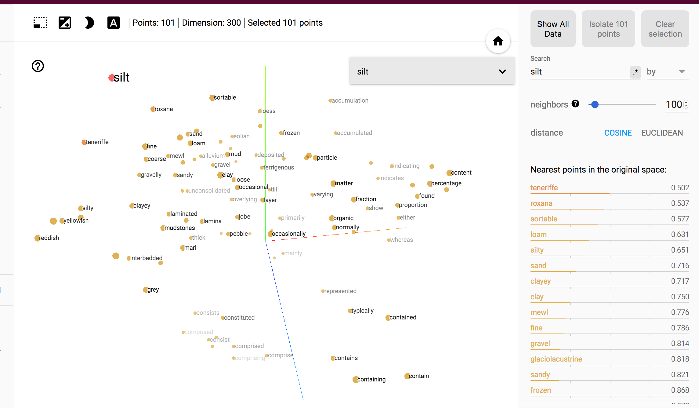

# geoVec-playground
playground for exploring geoVec pre-trained glove model of geoscience embeddings

paper: https://soil.copernicus.org/articles/5/177/2019/soil-5-177-2019.html

Data file link: https://osf.io/4uyeq/wiki/home/

Pay attention to .gitignore file as otherwise your git can be clogged with files that are too big!

Use this notebook, not the other one: Exploration of GeoVec Word Embeddings & Parsed English Only Version.ipynb

Theoretically should front-end only with identical notebook as run from local machine but there's some bug I haven't figured out yet!!!!: https://justingosses.github.io/geoVec-playground/embedding-projector-standalone/embedding-projector-standalone-master/

For now, quickest way to see the embedding is to clone this repo and run from source folder `python3 -m http.server http://0.0.0.0:8000/embedding-projector-standalone/embedding-projector-standalone-master/`

This repo is just messing around with this original word embedded work by these authors:
CITATION¶
@misc{padarian2019geovec, title={GeoVec}, url={https://osf.io/4uyeq}, DOI={10.17605/OSF.IO/4UYEQ}, publisher={OSF}, author={Padarian, José and Fuentes, Ignacio}, year={2019} }z

Article
@misc{padarian2019word, title={Word embeddings for application in geosciences: development, evaluation and examples of soil-related concepts}, url={https://doi.org/10.5194/soil-2018-44} DOI={10.5194/soil-2018-44}, publisher={Copernicus GmbH}, author={Padarian, José and Fuentes, Ignacio}, year={2019}, journal={SOIL Discuss} }

Data file of the pretrained emb
